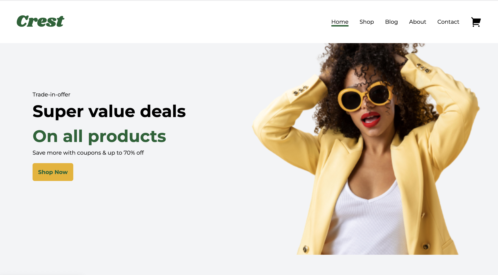
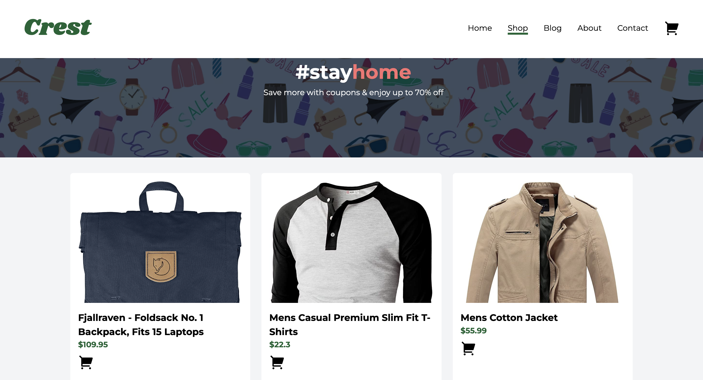

## Crest E-commerce Website

Crest E-commerce Website is a responsive online platform with a user-friendly interface designed to adapt flawlessly to various devices. It is an e-commerce website that allows users to explore the diverse catalogue of products available and shop at a discounted rate.

## Table of contents

- [Overview](#overview)
  - [The challenge](#the-challenge)
  - [Screenshots](#screenshot)
  - [Links](#links)
- [My process](#my-process)
  - [Built with](#built-with)
  - [Resources](#useful-resources)
- [Author](#author)

## Overview

### The Challenge

Users should be able to:

- Add products to cart
- see more available product options
- View the optimal layout for the interface depending on their device's screen size
- See hover and focus states for all interactive elements on the page

### Screenshots

### Links

- Solution URL: [https://github.com/Khemmie-Ray/Crest-online-store.git](https://github.com/Khemmie-Ray/Crest-online-store.git)
- Live Site URL: [https://crest-e-store.netlify.app/](https://crest-e-store.netlify.app/)

## My Process

### Built with

* HTML
* TailwindCSS
* JavaScript
* Fakestore API

### Resources

The resources used for this especially the images were gotten from

* [Unsplash](https://unsplash.com/)
* [FreePik](https://www.freepik.com/)
* [Pexels](https://www.pexels.com/)

### Author

Khemmie-Ray